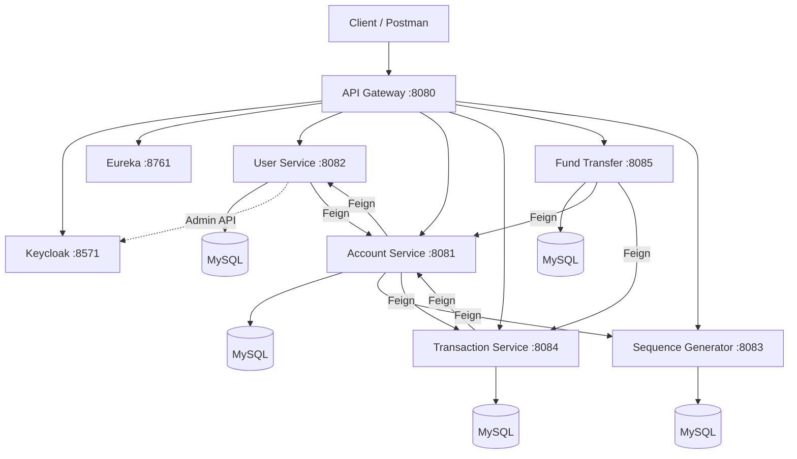
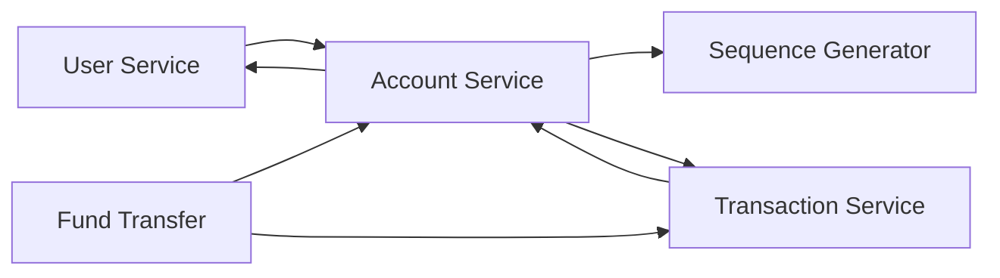

## About This Project

This repository is based on the original project:

**[Spring Boot Microservices Banking Application](https://github.com/kartik1502/Spring-Boot-Microservices-Banking-Application)** by **Kartik**.

The original project provides a banking backend built with Spring Boot and a microservices architecture.

This repository is maintained as a **personal learning and engineering project**. The original implementation is kept as the starting point, while future commits may introduce refactoring, architectural improvements, security improvements, testing, and other enhancements.

### Why This Repository Exists

The purpose is to study how an existing microservices application works before modifying its architecture.

The development approach is:

```text
Original Project
      ↓
Understand the existing system
      ↓
Document the baseline architecture
      ↓
Refactor
      ↓
Add improvements
      ↓
Compare the results

```

The original implementation is therefore treated as the **baseline version** of this project.

---

## Baseline Architecture

The original application is a banking system composed of several Spring Boot microservices.

It supports:

- Customer registration
- Bank account creation
- Deposit and withdrawal
- Account-to-account transfers
- JWT authentication
- Service discovery
- Synchronous service-to-service communication

There is no frontend in this repository. APIs can be tested using Postman or `curl`.




## Services


| Service             | Port   | Responsibility                                   |
| ------------------- | ------ | ------------------------------------------------ |
| Service Registry    | `8761` | Eureka service discovery                         |
| API Gateway         | `8080` | API entry point and JWT validation               |
| Account Service     | `8081` | Bank account management                          |
| User Service        | `8082` | Customer management and Keycloak synchronization |
| Sequence Generator  | `8083` | Account number generation                        |
| Transaction Service | `8084` | Deposits, withdrawals, and transaction ledger    |
| Fund Transfer       | `8085` | Account-to-account transfers                     |


## Service Communication

Business services communicate through **synchronous HTTP using OpenFeign**.

Eureka provides service discovery so services can communicate using logical service names instead of hard-coded host addresses.




The API Gateway handles external client traffic. It is not part of the internal Feign communication chain.

---

## API Gateway

External API requests use:

```text
http://localhost:8080

```


| Route                | Target              |
| -------------------- | ------------------- |
| `/api/users/**`      | User Service        |
| `/accounts/**`       | Account Service     |
| `/transactions/**`   | Transaction Service |
| `/fund-transfers/**` | Fund Transfer       |
| `/sequence/**`       | Sequence Generator  |


> The transfer endpoint uses `/fund-transfers/**`, not `/api/fund-transfers/**`.

---

## Security

The baseline implementation uses **Keycloak and JWT**.

Current security behavior:

- JWT validation is performed at the API Gateway.
- `/api/users/register` is publicly accessible.
- Other gateway endpoints require a Bearer token.
- Direct access to ports `8081–8085` does not enforce JWT validation.
- User Service uses the Keycloak Admin API to create and manage users.

Direct service access is primarily useful for local development and debugging.

---

## Technology Stack

- Java 17
- Spring Boot 2.7.x
- Spring Cloud 2021.0.8
- Spring Cloud Gateway
- Spring Cloud Netflix Eureka
- Spring Cloud OpenFeign
- Spring Data JPA
- MySQL
- Keycloak
- Maven

The baseline implementation does not use Kafka or RabbitMQ.

---

## Repository Structure

Each service is an **independent Maven project**.

```text
Banking-Microservices-Platform/
├── Service-Registry/
├── API-Gateway/
├── User-Service/
├── Account-Service/
├── Sequence-Generator/
├── Transaction-Service/
├── Fund-Transfer/
├── postman_collection/
└── docs/

```

This is not a Maven multi-module project and does not use a shared parent POM.

---

## Evolution Roadmap

The repository will evolve from the original implementation toward a more production-oriented architecture.

Potential improvements include:

```text
Baseline
   │
   ├── Code & package refactoring
   ├── API design improvements
   ├── Database & transaction improvements
   ├── Security hardening
   ├── Automated testing
   ├── Error handling
   ├── Observability
   ├── Performance improvements
   ├── Containerization
   └── Distributed system improvements

```

Each major improvement may be documented separately under `docs/`.

The goal is not simply to rewrite the original project, but to understand **why** each architectural change is necessary and what trade-offs it introduces.

---

## Attribution

The initial implementation is based on:

**Spring Boot Microservices Banking Application**  
Original author: **Kartik**

Original repository:

[https://github.com/kartik1502/Spring-Boot-Microservices-Banking-Application](https://github.com/kartik1502/Spring-Boot-Microservices-Banking-Application)

This repository is a personal derivative/learning project. Original source code and attribution are retained where applicable.